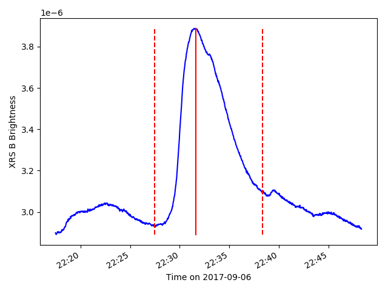

# flaregress

Predict solar flare lightcurves from limited observations. Below is an example observation with no prediction:

## Contents
All code is kept in [flaregress](flaregress) with tests in [tests](tests). 
The [original proposal](proposal/proposal.pdf) describing our approach 
with its source is in the [proposal](proposal) directory. [Data](data) 
includes the [GOES flare list](data/goes_list.csv) and the [RHESSI flare list](data/rhessi_list.csv). 

## Authors
*This project is a course project for 
Graduate Machine Learning 2018 at the University of Colorado Boulder and is written by:*

- Dave Achyut
- J. Marcus Hughes
- Mahesh Parab

If you'd like to contribute please [contact J. Marcus Hughes](email://jahu5138@colorado.edu).

